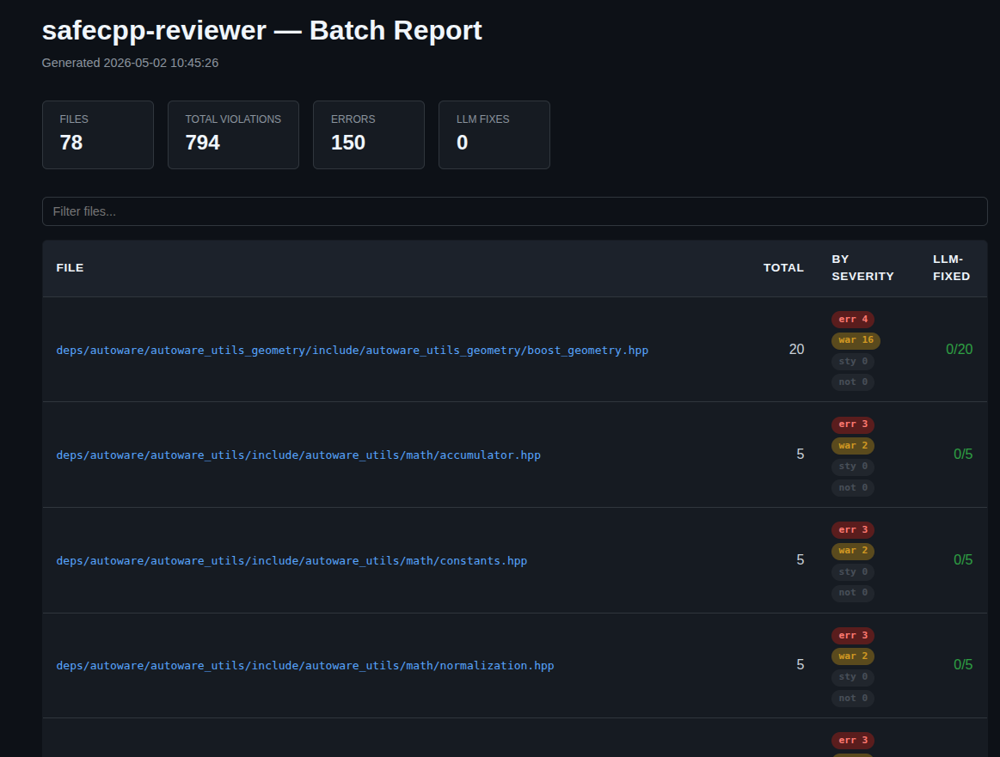
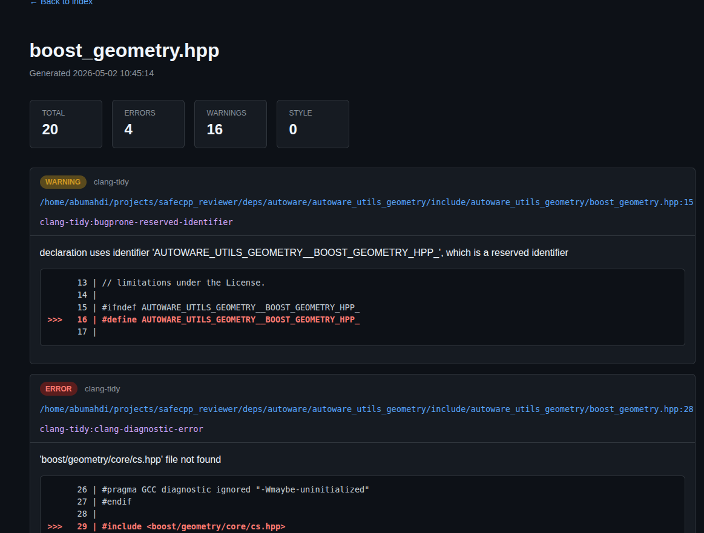
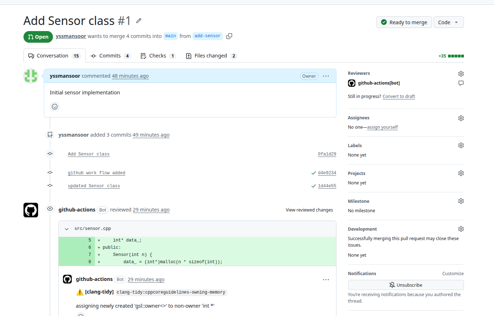
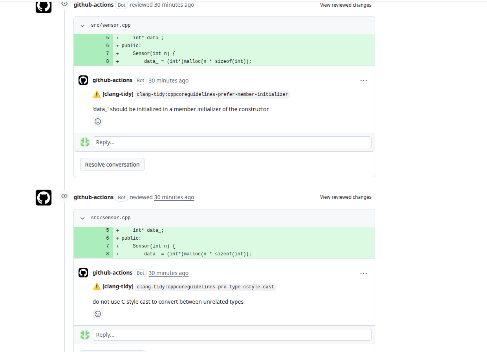
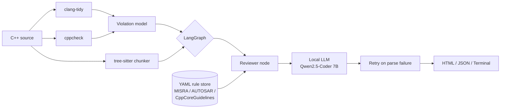

# safecpp-reviewer

Agentic LLM-powered static analysis for safety-critical C++. Combines clang-tidy and cppcheck output with a locally-hosted code-LLM that explains each violation against MISRA / AUTOSAR / CppCoreGuidelines and proposes fixes.

Built as a portfolio project for embedded / automotive / LLM engineering roles.


---

## What it does

Point it at a `.cpp` or `.hpp` file:

```bash
uv run safecpp review src/foo.cpp -f html -o report.html
```

The tool runs clang-tidy and cppcheck, normalizes their output into a single `Violation` schema, slices the source into function-level chunks with tree-sitter, and asks a local Qwen2.5-Coder model to review each violation against the relevant rule's documentation. Output is HTML, terminal, or JSON.

Real-world baseline on the [Autoware Universe `autoware_utils`](https://github.com/autowarefoundation/autoware_utils) package: **78 files, 794 violations, 150 errors** in under a minute (without LLM review).




## Live demo

The action runs on every C++ PR and posts inline review comments with violation explanations and one-click fix suggestions.

[**View the demo PR →**](https://github.com/yssmansoor/safecpp-demo/pull/1)




## Architecture



Pipeline highlights:

- **Static analysis**: subprocess wrappers around clang-tidy (regex parser) and cppcheck (XML parser) producing a unified `Violation` Pydantic model
- **Chunking**: tree-sitter-cpp parses the source AST so violations are reviewed with their full enclosing function as context, not arbitrary line windows
- **Knowledge base**: hand-authored YAML rule docs (CppCoreGuidelines + modernize + cppcheck) injected into the LLM prompt for grounded fixes
- **Orchestration**: LangGraph state machine with conditional retry on JSON parse failures; falls back to per-violation review when chunks aren't available
- **LLM**: llama.cpp with HIP backend on AMD RX 9070 XT, ~52 tok/s on Qwen2.5-Coder-7B Q5_K_M

## Quickstart

```bash
git clone git@github.com:yssmansoor/safecpp-reviewer.git
cd safecpp-reviewer
uv sync

# Static analysis only (fast — no LLM needed)
uv run safecpp review tests/fixtures/sample_violations.cpp -f html -o report.html

# With LLM review (needs llama.cpp server running on :8080)
make serve              # in another terminal
uv run safecpp review tests/fixtures/sample_violations.cpp -f html -o report.html

# Batch a whole directory with index page
uv run safecpp batch $(find deps/autoware -name "*.hpp") -o reports/
```

## Stack rationale

Decisions worth defending:

- **Local LLM, not API** — embedded codebases are often proprietary; analyzing them shouldn't require sending source to OpenAI. llama.cpp + a 7B coder model runs on a single consumer GPU and produces useful output.
- **LangGraph over a hand-rolled pipeline** — the project starts simple but grows toward agent patterns (retry, human-in-the-loop approval, multi-file context). Graph state and conditional edges scale where a procedural pipeline doesn't.
- **Tree-sitter over regex** — C++ is hostile to line-based parsing. Tree-sitter handles templates, namespaces, and macros with the same code path. The `Chunk` model exposes function/class boundaries that the LLM uses to reason about variable scope.
- **OpenAI SDK for transport, llama.cpp for inference** — the OpenAI SDK is the de-facto standard for chat completion clients; using it against a llama.cpp `/v1/chat/completions` endpoint means the same code runs unchanged against OpenAI, Anthropic-compatible servers, or vLLM. Easy to swap the backend without rewriting the agent.

## Limitations

- The 7B model occasionally produces invalid JSON; the parser has three fallback strategies (strict JSON → escape-and-retry → regex extraction) and the graph adds one retry round. Larger models would reduce this.
- Header-only template-heavy files sometimes confuse tree-sitter; the chunker falls back gracefully but the LLM loses context in those cases.
- The rule store covers ~15 rules across CppCoreGuidelines, modernize, bugprone, and cppcheck. Full MISRA C++ 2008 / 2023 coverage is future work — the schema and loader support it, the rule docs aren't authored yet.
- No fix-validation loop yet: the LLM proposes a fix, but the tool doesn't re-run clang-tidy on the fix to verify it's actually clean. Phase 8.

## Project structure

```
src/safecpp_reviewer/
├── analyzer/          # clang-tidy + cppcheck wrappers, Violation model
├── chunker/           # tree-sitter-cpp parser → Chunk model
├── knowledge/         # YAML rule store (CppCoreGuidelines etc.)
├── llm/               # OpenAI-SDK-backed client for llama.cpp
├── agent/             # LangGraph nodes, prompts, ReviewerState
├── report.py          # HTML report renderer
├── report_index.py    # Multi-file index page
└── cli.py             # typer entry point
```

## Hardware

Developed and tested on:

- AMD Radeon RX 9070 XT (16 GB VRAM) running ROCm 7.2.2
- Intel Raptor Lake-S, 32 GB RAM
- Ubuntu 24.04, kernel 6.17

Model: `Qwen2.5-Coder-7B-Instruct-Q5_K_M.gguf` served by llama-server on port 8080.

## License

MIT.
